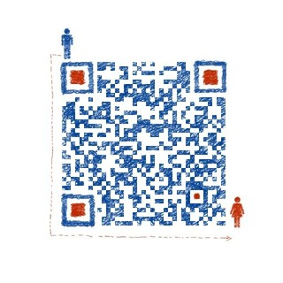

# 个人信息

- 李烨/男/1995
- 应届毕业生/本科/华南农业大学 电子信息专业
- 工作经验：半年实习
- 技术博客：http://www.jianshu.com/nb/5044817
- Github：https://github.com/LY550275752
- 期望职位：web前端工程师
- 期望工作城市：深圳

# 联系方式

- 手机：13682307128
- Email：550275752@qq.com
- 微信:LY550275752

# 技能清单
- 熟练掌握HTML,CSS,Javascript
- 熟练运用JQuery,了解内部原理并自己实现一个Jquery
- 擅长使用Vue框架以及全家桶Router,Vuex,Resource
- 基本会用webpack自动构建工具并运用到项目中
- 了解PHP和MYSQL基本语法，有一定的数据结构和算法基础

# 个人项目

- [Ye.js](https://github.com/LY550275752/Ye)   自己实现的一个类似JQuery的框架
- [Vin.js](https://github.com/LY550275752/Vin)  学习Vue原理，并实现的一个MVVM框架
- [Vue音乐播放器](https://github.com/LY550275752/my-music)   基于Webpack+Vue.js,Vuex,Vue-router,Vue-resource
- [myDemo](https://github.com/LY550275752/myDemo)   自己学习路上玩的各种Demo
- [三个小游戏](https://github.com/LY550275752/GameParks) 五子棋，小方块，2048
- [百度前端学院任务](https://github.com/LY550275752/MyBaiduIFE)       百度IFE团队的一个活动

# 工作经历

## 广州洪睿科技有限公司 ( 2016年9月 ~ 2016年12月 )

	工作内容：加入开发组项目，负责前端开发，参与技术分享会分享，讨论项目架构

### 热领公众号物业服务平台

	- 项目描述：为物业公司开发一个基于微信端的物业管理系统，包括公告，财务信息，业主投票，以及业主之间的社交。
	- 负责内容：负责“我的”模块，部分社区模块，登陆模块的前端开发，以及后期维护和修bug。使用Sea.js作模块化，使用Vue+Jquery作基本技术栈。

### 招商证券PC端微信公众号管理平台
	
	- 项目描述：开发一个pc端的SPA单页面应用，统一管理旗下一百多个公众号，包括素材管理，系统权限设置，统一回复等功能。
	- 负责内容：负责菜单模块，数据统计模块，素材模块的前端开发，以及后期维护和修bug。使用Sea.js作模块化，使用Vue+Jquery作基本技术栈。使用到Jquery UI, highchart实现菜单拖拽排序和可视化数据分析

# 自我评价

1. 电子专业，对计算机基础有一定的了解，大三开始自学前端，自学能力很强
2. 自我调控能力强，能抗压并及时调整状态，思考并解决遇到的问题
3. 热爱互联网，乐观开朗，善于交流，有很强的团队意识和时间观念
4. 对技术有极强的热情和追求，时刻关注业界新动态和探索新技术，热爱分享和交流
5. *自认为最大的优点就是刻苦钻研还有永远对新鲜事物保持好奇心*